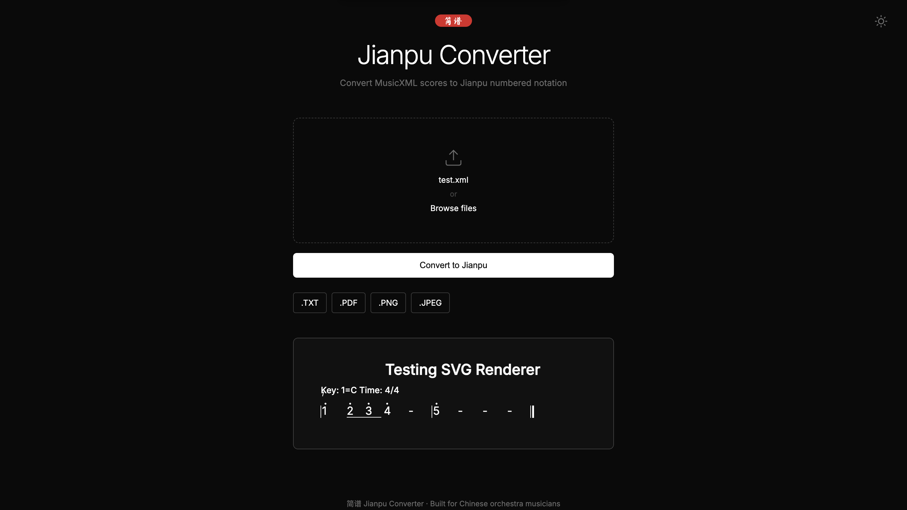

# 简谱 Jianpu Converter

> A client-side web application that converts MusicXML and MIDI files into Chinese Numbered Musical Notation (Jianpu / 简谱).  
> Built by a Chinese orchestra flute player, for Chinese orchestra musicians.

**[🎼 Try the Live Demo](https://huichiy.github.io/Music-Score-Converter/)**



---

## Motivation

Musicians in Chinese orchestras — especially melody instrument players such as 笛子、二胡、高胡 — primarily read Jianpu (简谱).

However, most sheet music available online is distributed in Western staff notation.

Manual transnotation:

- is slow

- introduces mistakes

- interrupts rehearsal workflow

As a flute player in a Chinese orchestra, I built this tool to automate that conversion so musicians can spend less time copying notes and more time playing.

---

## Features

| Feature | Details |
|---|---|
| **MusicXML & MIDI Support** | Accepts `.xml`, `.mxl`, `.mid`, `.midi` |
| **Auto Melody Detection** | Scores multi-part files by instrument name keywords, note density, and average pitch. Recognises Chinese instrument names (笛, 二胡, 高胡, 琵琶) and penalizes accompaniment parts (大阮, 低音, 扬琴) |
| **Accurate Music Theory** | Handles key signatures, accidentals, flat/sharp contexts, ties across measures, dotted notes, and all standard rhythmic durations |
| **Authentic Jianpu Output** | Renders proper 延音线 (extension dashes), 减时线 (beaming underlines), and octave dots above/below numbers |
| **SVG Score Rendering** | Output is a fully scalable SVG with correct measure layout, barlines, and line wrapping — not plain text |
| **Multiple Export Formats** | `.TXT` plain text, `.PDF` via print stylesheet, `.PNG` and `.JPEG` via Canvas renderer |
| **Zero Dependencies** | No server, no build tools, no install. Open `index.html` in any modern browser |
| **Light / Dark Theme** | Minimal UI inspired by Notion and Linear, with live theme switching that re-renders the SVG output |

---

## Tech Stack


| Library | Purpose |
|---|---|
| [@tonejs/midi](https://github.com/Tonejs/Midi) | MIDI file parsing |
| [JSZip](https://stuk.github.io/jszip/) | `.mxl` compressed file extraction |
| [Inter](https://fonts.google.com/specimen/Inter) | UI typography |
| [Ma Shan Zheng](https://fonts.google.com/specimen/Ma+Shan+Zheng) | Chinese calligraphy badge font |
| GitHub Pages | Hosting |

No frameworks. No build tools. Vanilla JS only.

---

## Project Structure

```
Music-Score-Converter/
├── index.html        — Markup and CSS
└── js/
    ├── parser.js     — MusicXML & MIDI parsing, pitch-to-scale-degree conversion
    ├── renderer.js   — SVG score rendering engine
    ├── downloader.js — Export functions (TXT, PDF, PNG, JPEG)
    └── app.js        — UI state, event handlers, file handling, theme toggle
```

---

## How It Works

### 1. File Parsing
- **MusicXML / MXL** — The `.mxl` container is decompressed via JSZip, reading `META-INF/container.xml` to locate the root XML file. The XML is then parsed with the browser's native `DOMParser` to extract key signature (`<fifths>`), time signature (`<beats>`, `<beat-type>`), and all `<note>` elements per measure.
- **MIDI** — Parsed via `@tonejs/midi`. Key signature is read from the header. The track with the highest note count is selected as the melody line. Notes are mapped to measures using tick position and PPQ.

### 2. Pitch Conversion
Each note undergoes a three-step conversion:
1. **Diatonic degree** — The note's step (C, D, E...) is compared against the tonic step to find its scale degree (1–7)
2. **Octave shift** — Calculated as `Math.round((noteSemi - (tonicSemi + scaleDegrees[degree])) / 12)` to determine how many octaves above or below the tonic register the note sits
3. **Accidental** — The intended semitone at the calculated octave is compared to the actual semitone; any mismatch produces a `#` or `b` prefix

### 3. Rhythm Parsing
Note type (`whole`, `half`, `quarter`, `eighth`, `16th`, `32nd`) is read from the `<type>` element. Dotted notes, tied notes, and grace notes are each handled separately:
- **Ties** — A `lastNoteWasTieStart` flag propagates across measure boundaries to correctly render cross-measure ties as `-`
- **Dots** — Appended as a visual dot in the SVG, or as extension beats for half/whole notes
- **Grace notes** — Skipped entirely to keep the melody line clean

### 4. SVG Rendering
A custom layout engine in `renderer.js` iterates over note objects and:
- Pre-calculates each measure's pixel width based on note durations
- Wraps lines when a measure would exceed `maxWidth`
- Draws barlines, measure numbers, octave dots (above for `octave > 0`, below for `octave < 0`), beaming underlines for eighth/sixteenth notes, and extension dashes for held notes
- Escapes SVG-unsafe characters in score titles

### 5. Export
| Format | Method |
|---|---|
| `.TXT` | Plain text string serialized from the parsed note objects |
| `.PDF` | `window.print()` with a dedicated `@media print` stylesheet |
| `.PNG` / `.JPEG` | SVG serialized → Blob URL → drawn onto a 2× Canvas via `document.fonts.ready` to ensure font loading before rasterization |

---

## Getting Started

**Option A — Live Demo**
Visit **[huichiy.github.io/Music-Score-Converter](https://huichiy.github.io/Music-Score-Converter/)**

**Option B — Run Locally**
```bash
git clone https://github.com/huichiy/Music-Score-Converter.git
cd Music-Score-Converter
```

> **Note:** Because the app loads separate JS files, you must serve it via a local HTTP server rather than opening `index.html` directly via `file://`.
>
> ```bash
> # Python (recommended)
> python3 -m http.server 8000
>
> # Node.js alternative
> npx serve .
> ```
> Then visit `http://localhost:8000`

---

## Known Limitations

| Limitation | Reason |
|---|---|
| **Single melody line only** | Chord voices and harmony notes are intentionally skipped to produce a readable melody line |
| **Mid-piece key changes not supported** | Only the first `<key>` element is read; modulation mid-score is not yet tracked |
| **MIDI triplets approximate** | MIDI has no semantic triplet encoding; durations are snapped to nearest binary value (quarter, eighth, etc.) |
| **MIDI key detection** | Relies on the key signature event in the MIDI header; files exported without this metadata default to C major |
| **PDF layout** | Uses the browser's native print dialog; margin and page-break behaviour varies by browser |
| **No multi-voice rendering** | Each part is rendered as a single linear melody; simultaneous voices are not yet supported |

---

## Roadmap

- [ ] Mid-piece key change detection and re-mapping
- [ ] Repeat signs and D.C. / D.S. markings (段落反复记号)
- [ ] Tempo (速度) and dynamic markings (力度记号) in output
- [ ] Multi-voice rendering — duet parts side by side
- [ ] Jianpu image / PDF → MusicXML via OCR pipeline (Phase 3)
- [ ] Mobile-optimised layout and touch interactions

---

## 中文说明

**[🎼 在线体验](https://huichiy.github.io/Music-Score-Converter/)**


---

### 项目动机

中国乐团的乐手——尤其是笛子、二胡、高胡等旋律乐器演奏者——主要使用简谱。

然而，网上大多数乐谱都是以西洋五线谱形式发布的。

手动转谱：

- 耗时

- 容易出错

- 打断排练流程

作为一名中国乐团的笛子演奏者，我开发了这个工具来自动转换乐谱，让乐手们可以减少抄谱的时间，把更多的时间投入到演奏中。

---

### 功能列表

| 功能 | 说明 |
|---|---|
| **支持 MusicXML 与 MIDI** | 接受 `.xml`、`.mxl`、`.mid`、`.midi` 格式 |
| **智能旋律识别** | 综合乐器名称关键词、音符密度与平均音高自动评分选择主旋律声部。支持华乐器名（笛、二胡、高胡、琵琶），对伴奏声部（大阮、低音、扬琴）进行降权 |
| **精准乐理解析** | 正确处理调号、临时升降号、跨小节延音线、附点音符及所有标准时值 |
| **标准简谱输出** | 输出包含增时线（延音线）、减时线（连音线）与高低八度点的规范简谱 |
| **SVG 乐谱渲染** | 输出为可缩放 SVG，包含正确的小节布局、纵线与自动换行 |
| **多格式导出** | 支持 `.TXT` 纯文本、`.PDF`（浏览器打印）、`.PNG` 与 `.JPEG`（Canvas 渲染） |
| **无需安装** | 无服务器、无构建工具、无依赖，直接用浏览器打开 `index.html` |
| **深色/浅色主题** | 极简 UI，主题切换时 SVG 输出实时重新渲染 |

---

### 技术栈


| 库 | 用途 |
|---|---|
| [@tonejs/midi](https://github.com/Tonejs/Midi) | MIDI 文件解析 |
| [JSZip](https://stuk.github.io/jszip/) | `.mxl` 压缩包解压 |
| [Inter](https://fonts.google.com/specimen/Inter) | 界面字体 |
| [Ma Shan Zheng 马善政](https://fonts.google.com/specimen/Ma+Shan+Zheng) | 简谱标识毛笔字体 |
| GitHub Pages | 部署托管 |

纯原生 JS，无框架，无构建工具。

---

### 项目结构

```
Music-Score-Converter/
├── index.html        — HTML 结构与 CSS 样式
└── js/
    ├── parser.js     — MusicXML 与 MIDI 解析、音高转音级逻辑
    ├── renderer.js   — SVG 乐谱渲染引擎
    ├── downloader.js — 导出功能（TXT、PDF、PNG、JPEG）
    └── app.js        — UI 状态、事件处理、文件读取、主题切换
```

---

### 工作原理

#### 1. 文件解析
- **MusicXML / MXL** — 通过 JSZip 解压 `.mxl` 容器，读取 `META-INF/container.xml` 定位根 XML 文件，再以浏览器原生 `DOMParser` 提取调号、拍号及各小节音符数据
- **MIDI** — 通过 `@tonejs/midi` 解析，从文件头读取调号，选取音符数最多的轨道作为旋律线

#### 2. 音高转换
每个音符经过三步转换：
1. **音级** — 将音符音名与主音对比，得出 1–7 的音级
2. **八度位移** — 通过半音数计算该音符相对于主音所在八度的偏移量
3. **临时升降号** — 将计算所得半音与实际半音对比，若不符则输出 `#` 或 `b` 前缀

#### 3. 节奏解析
- **延音线** — 使用 `lastNoteWasTieStart` 标志跨小节追踪延音线，延续音符渲染为 `-`
- **附点** — 在 SVG 中渲染为小圆点，或对二分音符/全音符扩展为延音拍
- **装饰音** — 自动跳过，保持旋律线整洁

#### 4. SVG 渲染
自定义排版引擎：预计算每小节像素宽度、超出最大宽度自动换行、绘制纵线、小节编号、八度点、减时线与增时线，并对乐谱标题进行 SVG 特殊字符转义。

#### 5. 导出
| 格式 | 方式 |
|---|---|
| `.TXT` | 将解析结果序列化为纯文本字符串 |
| `.PDF` | 调用 `window.print()`，配合 `@media print` 样式表 |
| `.PNG` / `.JPEG` | SVG 序列化为 Blob → 等待 `document.fonts.ready` 字体加载完成 → 绘制到 2× Canvas 后导出 |

---

### 已知限制

| 限制 | 原因 |
|---|---|
| **仅支持单旋律线** | 和弦与和声声部被有意跳过以保持输出整洁 |
| **不支持中途变调** | 目前仅读取第一个调号标记 |
| **MIDI 三连音近似处理** | MIDI 无三连音语义编码，时值对齐至最近二进制时值 |
| **MIDI 调号依赖文件头** | 无调号元数据的 MIDI 文件默认以 C 大调处理 |
| **PDF 排版依赖浏览器** | 页边距与分页行为因浏览器而异 |
| **暂不支持多声部渲染** | 各声部仅渲染为单一旋律线，同时多声部尚未支持 |

---

### 路线图

- [ ] 中途变调检测与重新映射
- [ ] 段落反复记号（D.C. / D.S.）
- [ ] 速度与力度标记输出
- [ ] 多声部并排渲染
- [ ] 简谱图片 / PDF → MusicXML OCR 识别管道
- [ ] 移动端布局优化

---

## License

MIT
