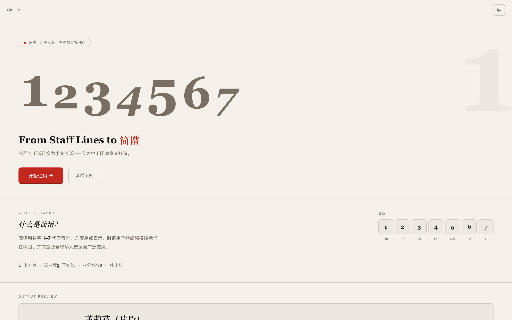
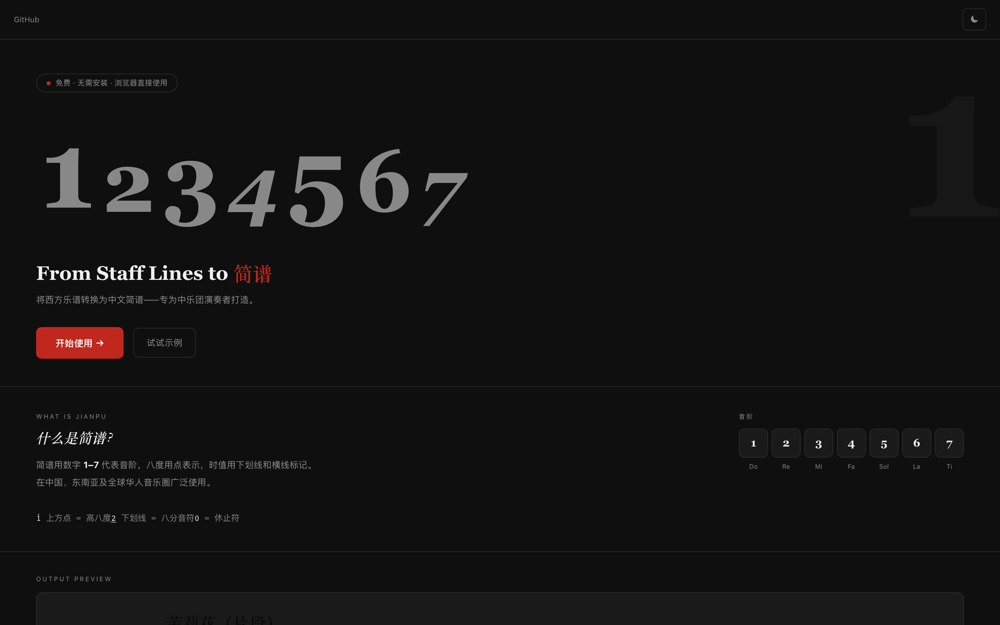
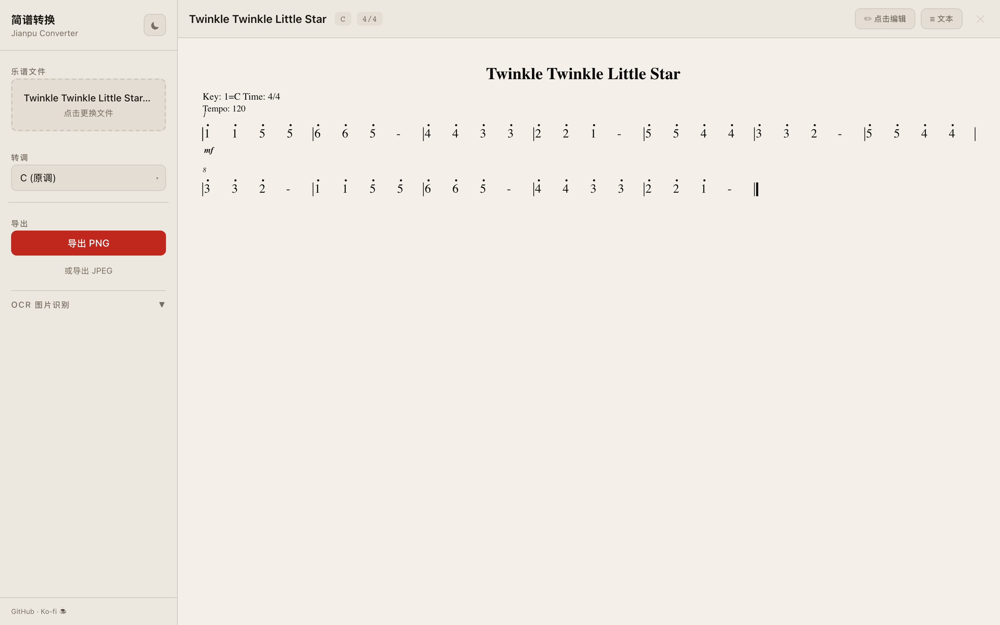
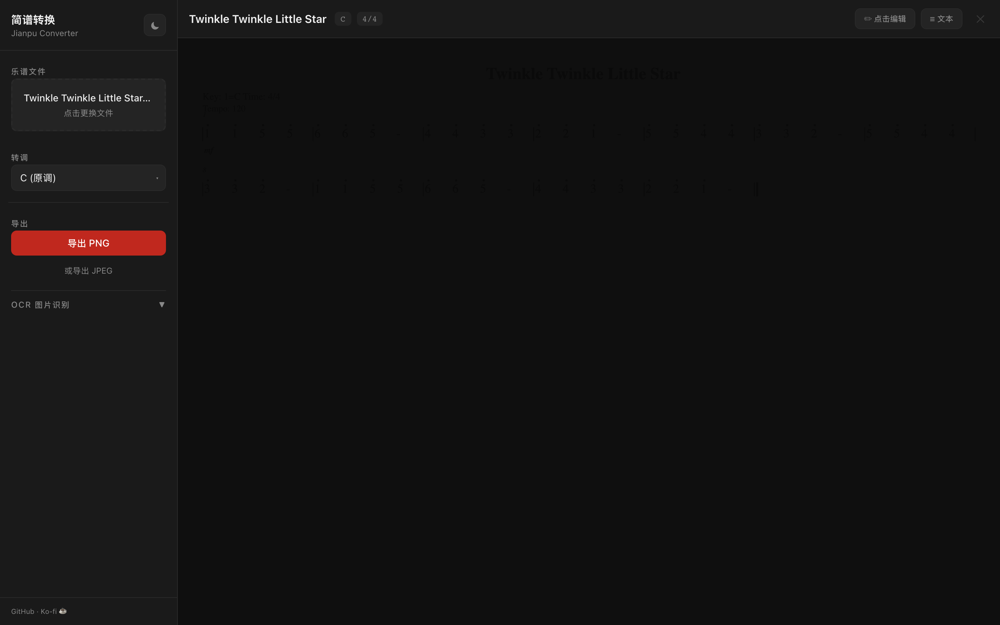
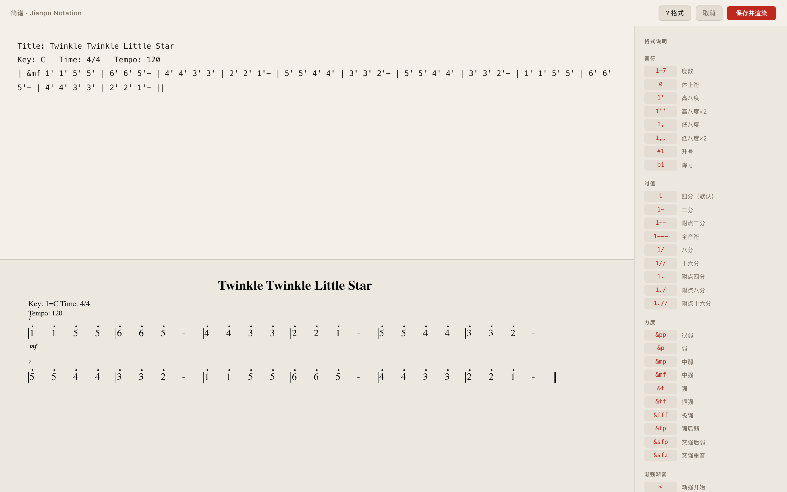
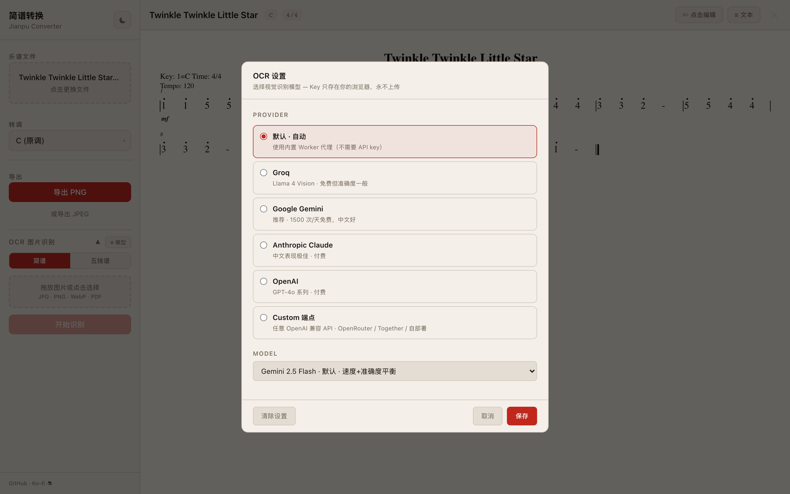

# 简谱 Jianpu Converter

> A client-side web application that converts MusicXML, MIDI, and ABC notation files into Chinese Numbered Musical Notation (Jianpu / 简谱).
> Built by a Chinese orchestra flute player, for Chinese orchestra musicians.

**[🎼 Try the Live Demo](https://huichiy.github.io/Music-Score-Converter/)**

<table>
  <tr>
    <td></td>
    <td></td>
  </tr>
  <tr>
    <td></td>
    <td></td>
  </tr>
  <tr>
    <td></td>
    <td></td>
  </tr>
</table>

---

## Motivation

Musicians in Chinese orchestras — especially melody instrument players such as 笛子、二胡、高胡 — primarily read Jianpu (简谱).

However, most sheet music available online is distributed in Western staff notation.

Manual transnotation:

- is slow
- introduces mistakes
- interrupts rehearsal workflow

As a flute player in a Chinese orchestra, I built this tool to automate that conversion so musicians can spend less time copying notes and more time playing.

---

## Features

| Feature | Details |
|---|---|
| **MusicXML, MIDI & ABC Support** | Accepts `.xml`, `.mxl`, `.mid`, `.midi`, `.abc` |
| **Auto Melody Detection** | Scores multi-part files by instrument name keywords, note density, and average pitch. Recognises Chinese instrument names (笛, 二胡, 高胡, 琵琶) and penalizes accompaniment parts (大阮, 低音, 扬琴) |
| **Accurate Music Theory** | Handles key signatures, mid-piece key changes, accidentals, flat/sharp contexts, ties across measures, dotted notes, and all standard rhythmic durations |
| **Authentic Jianpu Output** | Renders proper 延音线 (extension dashes), 减时线 (beaming underlines with beat-boundary grouping), and octave dots above/below numbers |
| **Tempo & Dynamic Markings** | Extracts BPM from MusicXML `<metronome>` and MIDI header; renders fixed dynamics (`p`, `f`, `mf`, `ff`, `sfz`, etc.) and hairpin dynamics (cresc/dim) |
| **Repeat & Direction Markings** | Renders `\|:` and `:\|` repeat barlines; extracts and displays D.C., D.S., Fine, and al Coda direction text |
| **Slurs & Chord Stacks** | Curved slur lines above connected notes; double-stop chord notes stacked under the melody |
| **Articulations & Grace Notes** | Renders accent, staccato, tenuto, marcato, fermata, and grace notes (倚音) above the corresponding number |
| **Transposition** | Dropdown selector transposes the score to any target key — essential for 笛子 players switching instrument lengths |
| **Click-to-Edit (Route A)** | Click any number in the rendered score to open a popup and change pitch, duration, accidental, or octave; re-renders instantly |
| **Text Editor (Route B)** | Toolbar `≡` button opens a dedicated full-screen editor with a 番茄简谱-aligned text format, live preview underneath, and bidirectional cursor sync between text and rendered notes |
| **PDF Input + Page Picker** | Drop a multi-page PDF into the OCR drop zone — page thumbnails appear, click any page to extract it as an image and feed the existing OCR pipeline |
| **Image OCR — Jianpu Recognition** | Upload a Jianpu image (`.jpg`, `.png`, `.pdf`) — AI transcribes it straight into the Route B text format; the result is editable and renders as a real score with one click (Beta) |
| **Image OCR — Staff to Jianpu** | Upload a Western staff notation image — AI converts it to editable, renderable Jianpu text (Beta) |
| **BYOK Multi-Provider OCR** | Default OCR runs Gemini 2.5 Flash via a Cloudflare Worker proxy (key stays on the Worker, never in the JS bundle). Power users can paste their own key for Gemini Pro, Claude 3.5 Sonnet, GPT-4o, Groq, or any OpenAI-compatible endpoint — keys live in browser `localStorage` only |
| **SVG Score Rendering** | Output is a fully scalable SVG with correct measure layout, barlines, line wrapping, and multi-measure rest brackets |
| **Multiple Export Formats** | `.PNG` and `.JPEG` via Canvas renderer |
| **Try with Sample File** | One-click demo with a built-in sample score — no file upload needed to try the tool |
| **Two Themes** | A warm light theme and a dark theme; the SVG output re-renders on theme switch |
| **Mobile Responsive** | Sidebar collapses to a compact top panel on small screens |

---

## Tech Stack


| Library | Purpose |
|---|---|
| [React 18](https://react.dev/) + [TypeScript](https://www.typescriptlang.org/) | UI framework + static types |
| [Vite 6](https://vitejs.dev/) | Dev server + build tooling |
| [Tailwind CSS v4](https://tailwindcss.com/) | Utility-first styling |
| [Zustand](https://zustand-demo.pmnd.rs/) | Lightweight global state |
| [Radix UI](https://www.radix-ui.com/) | Accessible primitives (dialog, select, tooltip) |
| [@tonejs/midi](https://github.com/Tonejs/Midi) | MIDI file parsing |
| [JSZip](https://stuk.github.io/jszip/) | `.mxl` compressed file extraction |
| [pdfjs-dist](https://github.com/mozilla/pdf.js/) | Render PDF pages to image for OCR (lazy-loaded) |
| [Google Gemini](https://ai.google.dev/) | Vision AI for image OCR (default, via Worker proxy) |
| [Anthropic Claude](https://www.anthropic.com/) · [OpenAI](https://openai.com/) · [Groq](https://groq.com/) | Optional BYOK vision providers |
| [Cloudflare Workers](https://workers.cloudflare.com/) | Optional API-key proxy (~120 LoC, free tier) |
| GitHub Pages | Hosting |

File parsing, rendering, transposition, and export run **entirely client-side**. OCR is the only network call — it goes either to a Cloudflare Worker proxy (default, key kept off the bundle) or directly to your chosen provider (BYOK).

---

## Project Structure

```
Music-Score-Converter/
├── docs/
│   ├── JIANPU_FORMAT.md          — Route B text editor format spec
│   └── screenshots/              — README screenshots
├── scripts/
│   └── test-roundtrip.ts         — Route B serialize/parse round-trip tests
├── worker/                       — Optional Cloudflare Worker (OCR proxy)
│   ├── src/index.ts              — OpenAI-shape → Gemini translator
│   ├── wrangler.toml
│   └── README.md                 — Worker deploy guide
├── src/
│   ├── components/
│   │   ├── EditNotePopup.tsx     — Route A click-to-edit popup
│   │   ├── EditTextOverlay.tsx   — Route B full-screen text editor
│   │   ├── ExportButtons.tsx     — PNG / JPEG export
│   │   ├── FileUpload.tsx        — Drag & drop / file picker
│   │   ├── LandingPage.tsx       — Pre-conversion welcome screen
│   │   ├── OcrSection.tsx        — AI image OCR panel
│   │   ├── OcrSettings.tsx       — BYOK provider / model / API key modal
│   │   ├── PartSelector.tsx      — Multi-part MusicXML selector
│   │   ├── PdfPagePicker.tsx     — PDF thumbnail grid for picking a page
│   │   ├── ScoreOutput.tsx       — Rendered SVG container
│   │   ├── Sidebar.tsx           — Upload + options + export sidebar
│   │   ├── Toolbar.tsx           — Top toolbar with editor entry points
│   │   └── TransposeSelect.tsx   — Key transposition dropdown
│   ├── hooks/
│   │   ├── useFileHandler.ts     — File parsing + render orchestration
│   │   └── useOcr.ts             — OCR runner (delegates to vision adapter)
│   ├── lib/
│   │   ├── abcParser.ts          — ABC notation parser
│   │   ├── editor.ts             — Route B text serialize / parse + position tracking
│   │   ├── parser.ts             — MusicXML parser + pitch conversion + transposition
│   │   ├── pdfTools.ts           — Lazy-loaded pdfjs wrapper
│   │   ├── renderer.ts           — SVG layout engine
│   │   ├── downloader.ts         — PNG / JPEG export
│   │   ├── utils.ts              — Shared helpers
│   │   └── vision/               — Provider-agnostic OCR adapters
│   │       ├── adapters/
│   │       │   ├── gemini.ts     — Google Gemini direct
│   │       │   ├── anthropic.ts  — Claude with browser-direct header
│   │       │   ├── openai.ts     — GPT-4o
│   │       │   ├── groq.ts       — Llama 4 Scout (legacy fallback)
│   │       │   ├── custom.ts     — Any OpenAI-compatible endpoint
│   │       │   └── openaiCompat.ts — Shared chat-completions helper
│   │       ├── types.ts          — VisionAdapter interface + provider config
│   │       ├── prompts.ts        — System / user prompts (shared across providers)
│   │       ├── utils.ts          — base64, error unwrap
│   │       └── index.ts          — Adapter factory + localStorage persistence
│   ├── store/
│   │   └── scoreStore.ts         — Zustand global state
│   ├── types/
│   │   └── score.ts              — Note / measure / chord type definitions
│   ├── App.tsx                   — Two-layer landing/tool entry
│   └── main.tsx
├── .github/workflows/deploy.yml  — GitHub Pages auto-deploy (reads VITE_OCR_WORKER_URL)
├── index.html
├── package.json
└── vite.config.ts
```

---

## How It Works

### 1. File Parsing

- **MusicXML / MXL** — The `.mxl` container is decompressed via JSZip, reading `META-INF/container.xml` to locate the root XML file. The XML is then parsed with the browser's native `DOMParser` to extract key signature (`<fifths>`), time signature (`<beats>`, `<beat-type>`), tempo (`<per-minute>`), dynamics (`<dynamics>`), hairpins (`<wedge>`), repeat barlines, slurs, direction markings, and all `<note>` elements per measure.
- **MIDI** — Parsed via `@tonejs/midi`. Key signature and tempo are read from the header. The track with the highest note count is selected as the melody line. Simultaneous notes (chords) are deduplicated by keeping the highest pitch. Notes are mapped to measures using tick position and PPQ.
- **ABC** — Custom ABC notation parser handles header fields (`K:`, `M:`, `Q:`, `T:`), accidentals (`^`, `_`, `=`), octave markers (`'`, `,`), and standard durations.

### 2. Pitch Conversion

Each note undergoes a three-step conversion:
1. **Diatonic degree** — The note's step (C, D, E...) is compared against the tonic step to find its scale degree (1–7)
2. **Octave shift** — Calculated as `Math.round((noteSemi - (tonicSemi + scaleDegrees[degree])) / 12)` to determine how many octaves above or below the tonic register the note sits
3. **Accidental** — The intended semitone at the calculated octave is compared to the actual semitone; any mismatch produces a `#` or `b` prefix

Mid-piece key changes are handled by re-reading `<fifths>` inside each measure's `<attributes>` block and updating the tonic on the fly.

### 3. Editing

Two parallel editing routes:

- **Route A — Click-to-edit popup**: Each rendered number carries `data-m` / `data-n` attributes pointing back to its measure/note index. Clicking opens a popup with degree, duration, accidental, and octave controls; confirming patches the note object and re-renders the SVG.
- **Route B — Text editor**: The score is serialized into a compact text format (see [`docs/JIANPU_FORMAT.md`](docs/JIANPU_FORMAT.md)). The editor offers a live preview (180ms debounce), a togglable format reference drawer, and **bidirectional cursor sync** — caret movement in the text highlights the matching note in the preview, and clicking a note in the preview jumps the caret onto its token.

The text format is aligned with the 番茄简谱 convention so users familiar with that ecosystem can paste scripts directly:
- `1/` eighth, `1//` sixteenth, `1.` dotted quarter, `1-` half, `1---` whole
- `&mf` `<` `>` `!` for dynamics and hairpins
- `|:` `:|` `||&fine` `||&dc` for repeats and directions
- `(1 2 3)` slurs, `1[>]` `1[.]` articulations, `1[2]` grace notes
- `[N]` multi-measure rest compression
- `{1}` `{2}` volta / 跳房子 endings, `~3` triplets (and other tuplets), `@3/4` mid-piece time signature changes

### 4. SVG Rendering

A custom layout engine in `renderer.ts` iterates over note objects and:
- Pre-calculates each measure's pixel width based on note durations
- Wraps lines when a measure would exceed `maxWidth` (derived from container width)
- Draws barlines, measure numbers, octave dots, beaming underlines grouped by beat boundary, and extension dashes for held notes
- Collapses runs of 2+ consecutive whole-measure rests into a numbered bracket block
- Renders repeat signs, D.C./D.S. direction text, tempo, dynamic markings, hairpins, slur arcs, articulations (accent / staccato / tenuto / marcato / fermata), grace notes, volta brackets, tuplet brackets (duration-corrected beaming), and mid-piece time signature changes

### 5. Export

| Format | Method |
|---|---|
| `.PNG` / `.JPEG` | SVG serialized → Blob URL → drawn onto a 2× Canvas via `document.fonts.ready` to ensure font loading before rasterization |

---

## Getting Started

**Option A — Live Demo**
Visit **[huichiy.github.io/Music-Score-Converter](https://huichiy.github.io/Music-Score-Converter/)**

**Option B — Run Locally**

```bash
git clone https://github.com/huichiy/Music-Score-Converter.git
cd Music-Score-Converter
npm install
npm run dev
```

Then visit the URL Vite prints (defaults to `http://localhost:5173`).

To produce a production build:

```bash
npm run build       # type-check + bundle into dist/
npm run preview     # serve the built bundle locally
```

To run the Route B round-trip tests:

```bash
npm run test
```

### Forking & deploying your own copy

OCR will work in BYOK mode out of the box — users paste their own API key in OCR Settings. If you want OCR to "just work" without users configuring anything, deploy the included Cloudflare Worker (see [`worker/README.md`](worker/README.md)) and set:

```bash
# Build-time secret (GitHub Actions reads this from repo Settings → Secrets)
VITE_OCR_WORKER_URL=https://your-worker.your-name.workers.dev
```

Without `VITE_OCR_WORKER_URL`, the "默认" provider button is disabled and the app falls back to BYOK-only.

---

## Known Limitations

| Limitation | Reason |
|---|---|
| **Single melody line only** | Chord voices and harmony notes are intentionally folded into stacked chord notes; full multi-voice rendering is not yet supported |
| **MIDI triplets approximate** | MIDI has no semantic triplet encoding; durations are snapped to nearest binary value |
| **MIDI key detection** | Relies on the key signature event in the MIDI header; files exported without this metadata default to C major |
| **Volta import from MusicXML** | `{N}` endings work in the text editor; MusicXML `<ending>` elements are not yet imported |
| **Flute-specific ornaments** | 颤音 / 波音 / 叠音 / 打音 / 花舌 etc. are intentionally not rendered — most are inferred by performers from context |

---

## Roadmap

- [x] Mid-piece key change detection and re-mapping
- [x] Repeat signs and D.C. / D.S. markings (段落反复记号)
- [x] Tempo (速度) and dynamic markings (力度记号) in output
- [x] Hairpin dynamics (crescendo / decrescendo)
- [x] Slur curves (连音线) above connected notes
- [x] Chord stacking (double stops)
- [x] Articulations (accent, staccato, tenuto, marcato, fermata)
- [x] Grace notes (倚音)
- [x] Mobile-optimised layout and touch interactions
- [x] Transposition (转调) — dropdown selector
- [x] ABC Notation (.abc) input support
- [x] Image OCR — Jianpu / staff-notation image transcription (Beta)
- [x] Route A click-to-edit popup editor
- [x] Route B text editor — 番茄简谱-aligned syntax, live preview, bidirectional cursor sync, mobile responsive
- [x] Landing page / tool layer separation
- [x] PDF input + page picker (lazy-loaded pdfjs)
- [x] BYOK multi-provider OCR — Gemini / Claude / GPT-4o / Groq / custom OpenAI-compatible
- [x] Cloudflare Worker proxy — default OCR uses Gemini 2.5 Flash with key off the bundle
- [x] Volta / 跳房子 (`{1}` `{2}`), tuplets (`~3`), and mid-piece time signature changes (`@3/4`) in the text editor
- [x] MusicXML import of articulations, fermata, grace notes (倚音), and tuplets (`<time-modification>`)
- [x] Route C: OCR output is Route B text — normalized, hand-editable, and rendered as a real score in one click
- [ ] Phase 3 OCR: box-select UI for picking one instrument out of a 总谱 (full score) PDF
- [ ] Playback (Tone.js) — hear the score as it's converted
- [ ] Flute-specific ornaments — 颤音 / 波音 / 叠音 / 打音 / 花舌
- [ ] Multi-voice rendering — duet parts side by side

---

## 中文说明

**[🎼 在线体验](https://huichiy.github.io/Music-Score-Converter/)**

<table>
  <tr>
    <td></td>
    <td></td>
  </tr>
  <tr>
    <td></td>
    <td></td>
  </tr>
  <tr>
    <td></td>
    <td></td>
  </tr>
</table>

---

### 项目动机

华乐团的乐手——尤其是笛子、二胡、高胡等旋律乐器演奏者——主要使用简谱。

然而，网上大多数乐谱都是以西洋五线谱形式发布的。

手动转谱：

- 耗时
- 容易出错
- 打断排练流程

作为一名华乐团的笛子演奏者，我开发了这个工具来自动转换乐谱，让乐手们可以减少抄谱的时间，把更多的时间投入到演奏中。

---

### 功能列表

| 功能 | 说明 |
|---|---|
| **支持 MusicXML、MIDI 与 ABC** | 接受 `.xml`、`.mxl`、`.mid`、`.midi`、`.abc` |
| **智能旋律识别** | 综合乐器名称关键词、音符密度与平均音高自动评分选择主旋律声部 |
| **精准乐理解析** | 处理调号、中途变调、临时升降号、跨小节延音线、附点音符及所有标准时值 |
| **标准简谱输出** | 输出包含增时线、按拍分组的减时线与高低八度点 |
| **速度与力度** | 提取 BPM；渲染固定力度（`p` `f` `mf` `ff` `sfz` 等）与渐强渐弱 hairpin |
| **反复与指示** | 渲染 `\|:` `:\|` 反复纵线；显示 D.C.、D.S.、Fine、al Coda |
| **连线与和弦** | 连音线弧形；双音/和弦垂直堆叠在主旋律下方 |
| **表情记号与倚音** | 重音、staccato、tenuto、marcato、fermata、倚音 |
| **转调** | 下拉菜单一键转到目标调——笛子换调必备 |
| **点击编辑（Route A）** | 点击渲染谱面上任何数字，弹出 popup 改音高 / 时值 / 升降号 / 八度 |
| **文本编辑器（Route B）** | 工具栏 `≡` 按钮打开全屏编辑器：上下分栏，文本在上，实时预览在下，光标双向同步；格式说明可侧滑抽屉显示。文本格式对齐番茄简谱约定 |
| **PDF 输入 + 页面选择器** | 把多页 PDF 拖进 OCR 区，弹出页面缩略图网格，点任一页即提取为图片送 OCR |
| **图片识别 — 简谱识别** | 上传简谱图片（JPG / PNG / PDF），AI 直接转录成 Route B 文本格式——识别结果可手改，一键渲染成真谱（Beta）|
| **图片识别 — 五线谱转简谱** | 上传五线谱图片，AI 转换成可编辑、可渲染的简谱文本（Beta）|
| **BYOK 多模型 OCR** | 默认走 Cloudflare Worker 代理 Gemini 2.5 Flash（key 在 Worker 里，不进 bundle）。进阶用户可在「OCR 设置」里粘自己的 key，切换 Gemini Pro / Claude 3.5 Sonnet / GPT-4o / Groq / 任意 OpenAI 兼容端点。Key 只存浏览器 localStorage |
| **SVG 乐谱渲染** | 输出可缩放 SVG，自动换行、多小节休止括号 |
| **多格式导出** | `.PNG` 与 `.JPEG`（Canvas 渲染） |
| **内置示例试用** | 一键加载示例乐谱 |
| **双色主题** | 浅色与深色主题，切换时 SVG 实时重新渲染 |
| **移动端适配** | 小屏自动折叠侧边栏 |

---

### 技术栈


| 库 | 用途 |
|---|---|
| React 18 + TypeScript | UI 框架 + 静态类型 |
| Vite 6 | 开发服务器与打包 |
| Tailwind CSS v4 | 原子化样式 |
| Zustand | 轻量全局状态 |
| Radix UI | 无障碍组件原语 |
| @tonejs/midi | MIDI 解析 |
| JSZip | `.mxl` 解压 |
| pdfjs-dist | PDF 页面渲染为图片（懒加载）|
| Google Gemini | 视觉 OCR（默认，经 Worker 代理）|
| Claude / OpenAI / Groq | BYOK 备选视觉模型 |
| Cloudflare Workers | 可选的 API key 代理（~120 行，免费层）|
| GitHub Pages | 部署 |

文件解析、渲染、转调、导出**全部在浏览器端完成**。唯一会触发网络请求的是 OCR——默认走 Cloudflare Worker 代理（key 在 Worker 里），或者直接调用你 BYOK 的提供商。

---

### 工作原理

#### 1. 文件解析
- **MusicXML / MXL** — JSZip 解压 `.mxl`，`DOMParser` 提取调号、变调、拍号、速度、力度、hairpin、反复、连线、指示标记、音符
- **MIDI** — `@tonejs/midi` 读取，选最长音轨为旋律，同时音保留最高音
- **ABC** — 自研 parser 处理头部字段、升降号、八度标记、时值

#### 2. 音高转换
三步：音级（1–7）→ 八度位移 → 临时升降号。中途变调实时跟随 `<fifths>` 更新。

#### 3. 编辑
- **Route A**：点击 SVG 数字 → 弹出 popup 改属性 → 即时重渲染
- **Route B**：序列化为 [简谱文本格式](docs/JIANPU_FORMAT.md) → 上下分栏编辑器：文本上、实时预览下、180ms 防抖。**光标双向同步**——文本光标移到音符 token 时预览对应数字高亮；点击预览数字时文本光标跳到对应 token

文本格式参考番茄简谱约定，方便熟悉番茄的用户直接粘贴：
- `1/` 八分、`1//` 十六分、`1.` 附点四分、`1-` 二分、`1---` 全音符
- `&mf` 力度、`<` `>` `!` 渐强渐弱
- `|:` `:|` `||&fine` `||&dc` 反复与段落
- `(1 2 3)` 连线、`1[>]` `1[.]` 表情、`1[2]` 倚音
- `[N]` 多小节休止压缩
- `{1}` `{2}` 跳房子、`~3` 三连音（及其他连音）、`@3/4` 中途变拍号

#### 4. SVG 渲染
自定义排版引擎：预计算小节宽度 → 自动换行 → 绘制纵线、小节编号、八度点、减时线、增时线、连续休止合并括号、反复符号、指示文字、力度、hairpin、连音弧、表情、倚音、跳房子括号、连音括号（时值修正）、中途变拍号

#### 5. 导出
SVG 序列化为 Blob → 等 `document.fonts.ready` → 绘制到 2× Canvas → PNG / JPEG

---

### 本地运行

```bash
git clone https://github.com/huichiy/Music-Score-Converter.git
cd Music-Score-Converter
npm install
npm run dev
```

打开 Vite 提示的 URL（默认 `http://localhost:5173`）。

生产构建：

```bash
npm run build       # 类型检查 + 打包到 dist/
npm run preview     # 本地预览生产 bundle
```

跑 Route B round-trip 测试：

```bash
npm run test
```

### Fork 后部署到自己的域名

OCR 默认就支持 BYOK——用户在「OCR 设置」里填自己的 key 即可。如果你想让 OCR **不需要用户配置**就能用，可以部署仓库里附带的 Cloudflare Worker（见 [`worker/README.md`](worker/README.md)）然后配 build secret：

```bash
# 在 GitHub repo Settings → Secrets and variables → Actions 里加
VITE_OCR_WORKER_URL=https://你的-worker.你的名字.workers.dev
```

没设的话，「默认」按钮会被禁用，只能走 BYOK 路径。

---

### 已知限制

| 限制 | 原因 |
|---|---|
| **单旋律线** | 和弦折叠为垂直堆叠，完整多声部尚未支持 |
| **MIDI 三连音近似** | MIDI 无三连音语义，时值对齐至最近二进制 |
| **MIDI 调号依赖文件头** | 无调号元数据时默认 C 大调 |
| **MusicXML 跳房子导入** | 文本编辑器已支持 `{N}` 语法；MusicXML `<ending>` 元素的导入暂未实现 |
| **暂不支持笛子专属技巧** | 颤音 / 波音 / 叠音 / 打音 / 花舌等暂不渲染——演奏者按语境补 |

---

### 路线图

- [x] 中途变调检测与重新映射
- [x] 段落反复记号（D.C. / D.S.）
- [x] 速度与力度标记输出
- [x] 渐强渐弱 hairpin
- [x] 连音线
- [x] 和弦堆叠（双音）
- [x] 表情记号（accent / staccato / tenuto / marcato / fermata）
- [x] 倚音（grace note）
- [x] 移动端布局优化
- [x] 转调
- [x] ABC Notation 输入
- [x] 图片识别 — 简谱 / 五线谱图片转录（Beta）
- [x] Route A 点击式编辑器
- [x] Route B 文本编辑器 — 番茄式语法、实时预览、光标双向同步、移动端响应式
- [x] Landing / 工具两层分离
- [x] PDF 输入 + 页面选择器（pdfjs 懒加载）
- [x] BYOK 多模型 OCR — Gemini / Claude / GPT-4o / Groq / Custom
- [x] Cloudflare Worker 代理 — 默认走 Gemini 2.5 Flash，key 不进 bundle
- [x] 跳房子 `{1}` `{2}`、连音 `~3`、中途变拍号 `@3/4`（文本编辑器）
- [x] MusicXML 导入表情记号、fermata、倚音、连音（`<time-modification>`）
- [x] Route C：OCR 结果即 Route B 文本——自动归一化、可手改、一键渲染成真谱
- [ ] Phase 3 OCR：总谱框选 UI，挑一行（如笛子）单独识别
- [ ] Playback 播放（Tone.js）
- [ ] 笛子专属技巧（颤音 / 波音 / 叠音 / 打音 / 花舌）
- [ ] 多声部并排渲染

---

## License

MIT
